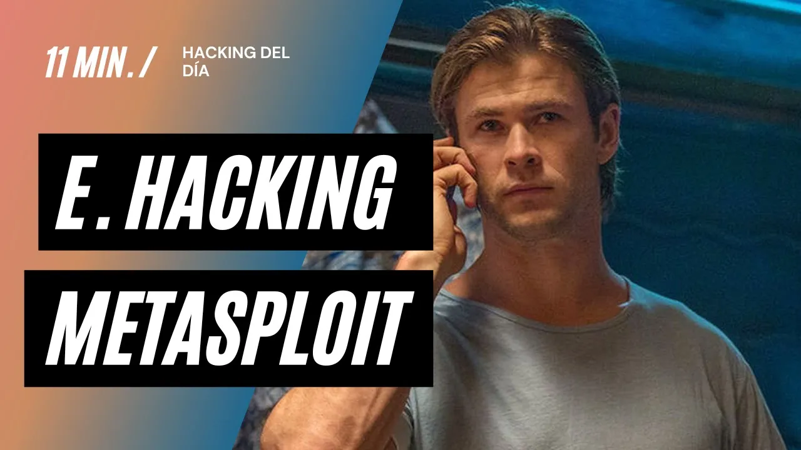
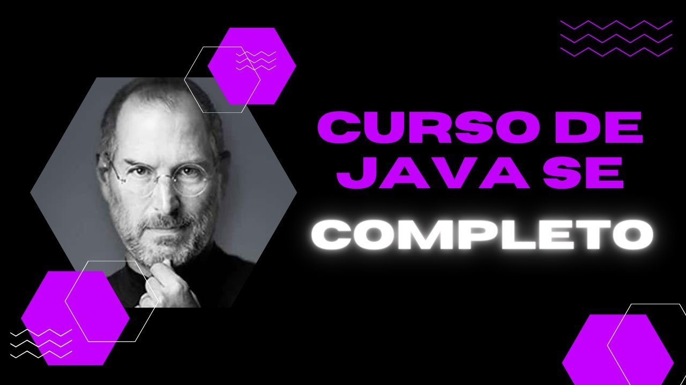
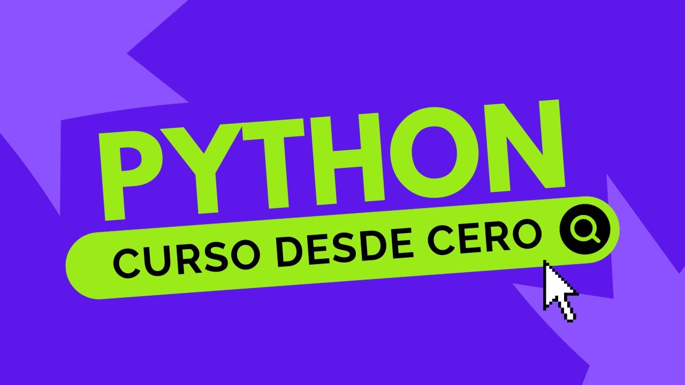

 

<h2 align="center">Hello world! I'm Alejandro ✨</h2>

  

  

 

# About Me

Hello! I'm Alejandro G Vera, a passionate and dedicated professional with a unique blend of expertise in both technology and human dynamics. My journey in the tech world began with an intensive focus on ethical hacking and full-stack development, which I pursued through comprehensive programs at the Universidad Tecnológica Nacional (UTN). Here are some highlights of my educational background and professional credentials:

### Technical Expertise

- **Ethical Hacking**: I hold an Expert University degree in Ethical Hacking from UTN, where I gained in-depth knowledge and hands-on experience in identifying and mitigating cybersecurity threats. My training involved rigorous coursework and practical exercises that honed my skills in penetration testing, vulnerability assessment, and secure coding practices.

- **FullStack Development**: As a Professional FullStack Developer, also from UTN, I am proficient in both front-end and back-end development. My technical toolkit includes React and Node.js for full-stack programming, and Java for backend development. This dual capability allows me to create seamless and robust applications, ensuring a smooth user experience and strong system integrity.

- **CS50x: Introduction to Computer Science and Cybersecurity**: I completed the renowned CS50x course from Harvard University, which provided a solid foundation in computer science principles and advanced cybersecurity concepts. This course emphasized problem-solving skills and the application of theoretical knowledge to real-world scenarios.

- **Google Cybersecurity Course**: Through Coursera, I enhanced my cybersecurity expertise with Google's specialized course. This program focused on modern security practices, risk management, and incident response strategies, equipping me with the latest tools and techniques to protect digital assets.

### Human Dynamics and Social Impact

Beyond my technical pursuits, I have a profound interest in understanding and improving human interactions and well-being. This passion is reflected in my additional qualifications:

- **Expert University Degree in Counseling**: My education in counseling has equipped me with the skills to support individuals in overcoming personal challenges and achieving their goals. This knowledge enhances my ability to work effectively in diverse teams and contribute to a positive organizational culture.

- **NLP Practitioner**: As a Practitioner of Neuro-Linguistic Programming, I utilize powerful techniques to improve communication, resolve conflicts, and foster personal growth. This training has been instrumental in my ability to lead and inspire others, both in professional and personal settings.

### Personal Philosophy and Approach

I firmly believe in the transformative power of knowledge and its ability to drive positive change. My approach is proactive and conciliatory, focusing on collaboration and collective growth. Whether working on a complex technical project or engaging in community initiatives, I strive to make a meaningful impact.

I am passionate about exploring social and psychological themes, as I believe that understanding human behavior is key to creating a better world. This holistic perspective informs my work in technology, where I aim to develop solutions that not only meet technical requirements but also enhance the overall quality of life.

Thank you for visiting my GitHub profile. I am excited to connect with like-minded professionals and explore opportunities for collaboration. Together, we can leverage technology and human understanding to build a brighter future.

Feel free to reach out to me for collaborations, discussions, or any queries you may have!

<h3>Alexx</h3>

<h2 align="center">Known technologies👨🏻‍💻</h2>
<!--tech stack icons-->

  

<!--Prueba-->

<h2 align="center">Some videos about IT from my Youtube channel👨🏻‍💻</h2>

<table align="left" >
<tr border="none">
  
  <td width="25%" align="center">
    

     
      

    

        
    
       
</td>
  
<td width="25%" align="center">
    

     
      

    

        
     
       
</td>
  
  <td width="25%" align="center">
    

     
      

    

        
    
       
</td>

   <td width="25%" align="center">
    

     
      

    

        
    
       
</td>
  
</tr>
</table>
  

 
  
<h1 align="center">My favorite projects:</h1>
