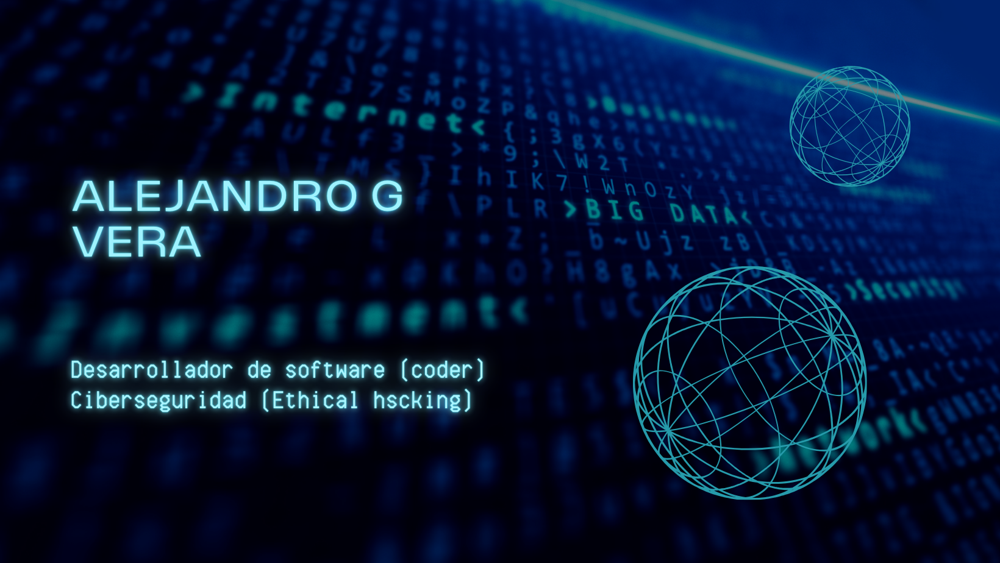

 

<h2 align="center">Hola mundo! Soy Alejandro ✨</h2>

  

  

 

# Sobre mí  

¡Hola y bienvenidos a mi perfil de GitHub! Soy un desarrollador de software con experiencia en desarrollo FullStack y ciberseguridad. Mi enfoque está en la creación de soluciones eficientes, seguras y escalables, aplicando buenas prácticas de desarrollo y optimización de sistemas. Además, tengo una sólida trayectoria en la enseñanza, habiendo capacitado a más de 50,000 estudiantes en Udemy en programación, seguridad informática y mejores prácticas tecnológicas.  

## 🚀 Habilidades y Tecnologías  

- **Desarrollo FullStack:** JavaScript (Node.js, React), Python, PHP  
- **Bases de Datos:** MySQL, PostgreSQL, MongoDB  
- **Ciberseguridad:** Ethical Hacking, OWASP, gestión de vulnerabilidades  
- **Infraestructura y DevOps:** Docker, Linux, CI/CD  
- **Metodologías:** Agile, Scrum, TDD  

## 🎓 Formación Académica  

- **Licenciatura en Gestión de Tecnologías de la Información** – UNPAZ  
- **Professional FullStack Developer** – UTN  
- **Experto Universitario en Ethical Hacking** – UTN  
- **Ciberseguridad** – Google (Coursera)  
- **Ciberseguridad y Seguridad de la Información** – Edutin  

## 💼 Experiencia Profesional  

He trabajado como **freelancer** en proyectos de desarrollo web y ciberseguridad, creando aplicaciones robustas y seguras. Mi experiencia también incluye la enseñanza en línea, donde he desarrollado cursos prácticos que han ayudado a miles de estudiantes a mejorar sus habilidades en programación y seguridad informática.  

## 💡 Filosofía y Objetivos  

Creo en la tecnología como motor de innovación y en el código limpio y seguro como base para el desarrollo eficiente. Me motiva el aprendizaje continuo y la mejora constante, por lo que en GitHub comparto proyectos, contribuciones y recursos para la comunidad de desarrolladores.  

📬 **¡Siempre abierto a colaborar y aprender!**  

<h3>Alexx</h3>

<h2 align="center">Tecnologías conocidas👨🏻‍💻</h2>
<!--tech stack icons-->

  

<!--Prueba-->

<h2 align="center"Algunos videos de IT de mi canal de Youtube👨🏻‍💻</h2>

<table align="left" >
<tr border="none">
  
  <td width="25%" align="center">
    

     
      

    

        
    
       
</td>
  
<td width="25%" align="center">
    

     
      

    

        
     
       
</td>
  
  <td width="25%" align="center">
    

     
      

    

        
    
       
</td>

   <td width="25%" align="center">
    

     
      

    

        
    
       
</td>
  
</tr>
</table>
  

 
  
<h1 align="center">Mis projectos favoritos:</h1>
