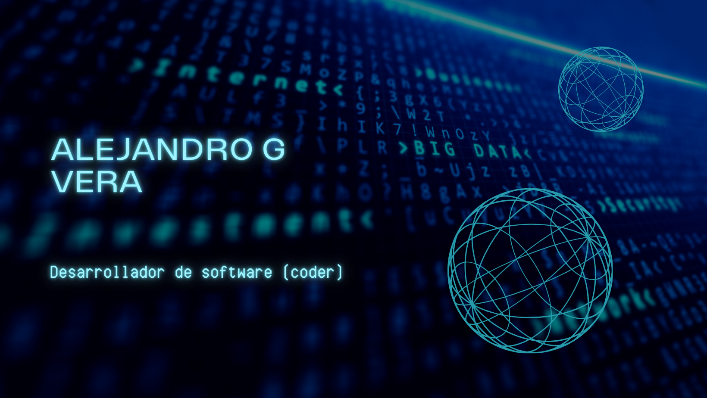

 

<h2 align="center">Hola mundo! Soy Alejandro ✨</h2>

  

  

 

# Sobre mí

¡Hola y bienvenidos a mi perfil de GitHub! Soy un apasionado de la tecnología y un profesional con una sólida formación académica y práctica en el campo de las tecnologías de la información, el desarrollo FullStack y la ciberseguridad. A lo largo de mi carrera, he tenido el privilegio de trabajar de forma independiente como freelancer y de compartir mi conocimiento con una gran comunidad de más de 50,000 estudiantes en la plataforma Udemy, donde enseño cursos orientados a la programación, la ciberseguridad y las mejores prácticas en tecnología.

### Formación Académica

Mi trayectoria educativa ha sido diversa y me ha permitido adquirir una visión integral del mundo tecnológico. Comencé mi formación en la **Universidad Nacional de José C. Paz (UNPAZ)**, donde cursé la **Licenciatura en Gestión de Tecnologías de la Información**, adquiriendo una base sólida en la administración de sistemas y el liderazgo en proyectos tecnológicos. 

Luego, en la **Universidad Tecnológica Nacional (UTN)**, continué desarrollando mis habilidades técnicas y prácticas con el curso de **Professional FullStack Developer**, un programa que me permitió trabajar en proyectos web complejos utilizando tecnologías de punta tanto en frontend como en backend. Además, completé el curso de **Experto Universitario en Ethical Hacking** en UTN, en el cual profundicé en la protección de datos, análisis de vulnerabilidades y metodologías avanzadas de hacking ético.

En mi búsqueda de conocimiento en ciberseguridad, también completé el curso de **Ciberseguridad** de **Google en Coursera**, que me aportó conocimientos adicionales en la protección de sistemas y gestión de riesgos de seguridad. Finalmente, en **Edutin**, cursé **Ciberseguridad y Seguridad de la Información**, enfocándome en los fundamentos y aplicaciones prácticas de la seguridad en sistemas de información.

### Experiencia Profesional

Mi experiencia profesional se ha desarrollado principalmente en el ámbito freelance, donde he trabajado en proyectos de diversa envergadura, aportando soluciones efectivas a problemas complejos en tecnología y seguridad de la información. Sin embargo, una de mis mayores satisfacciones ha sido enseñar y compartir mi conocimiento a través de la plataforma Udemy, donde actualmente tengo más de 50,000 estudiantes. Este logro no solo representa una gran satisfacción personal, sino que me motiva a seguir aprendiendo y perfeccionando mis habilidades para poder contribuir al crecimiento de mis alumnos y de la comunidad tecnológica en general.

### Mi Filosofía y Motivación

Mi pasión por la tecnología es el motor que me impulsa a explorar nuevos desafíos y a profundizar en el conocimiento técnico. Creo firmemente que la tecnología no solo transforma nuestra forma de vivir, sino que también nos da las herramientas para crear un futuro más seguro e innovador. Me esfuerzo cada día por ser un profesional mejor, aprendiendo de cada experiencia y de cada proyecto en el que me involucro, buscando siempre estar a la vanguardia en temas de ciberseguridad y desarrollo.

Aquí en GitHub, comparto mis proyectos y colaboro en iniciativas que promuevan el aprendizaje continuo y la innovación tecnológica. A través de este espacio, mi objetivo es aportar código, ideas y soluciones que puedan ser de utilidad para otros desarrolladores, estudiantes y profesionales de la tecnología. 

¡Gracias por visitar mi perfil y explorar mis proyectos! Siempre estoy abierto a colaborar y a aprender de otros profesionales que compartan mi pasión por la tecnología y el crecimiento constante.

<h3>Alexx</h3>

<h2 align="center">Tecnologías conocidas👨🏻‍💻</h2>
<!--tech stack icons-->

  

<!--Prueba-->

<h2 align="center"Algunos videos de IT de mi canal de Youtube👨🏻‍💻</h2>

<table align="left" >
<tr border="none">
  
  <td width="25%" align="center">
    

     
      

    

        
    
       
</td>
  
<td width="25%" align="center">
    

     
      

    

        
     
       
</td>
  
  <td width="25%" align="center">
    

     
      

    

        
    
       
</td>

   <td width="25%" align="center">
    

     
      

    

        
    
       
</td>
  
</tr>
</table>
  

 
  
<h1 align="center">Mis projectos favoritos:</h1>
