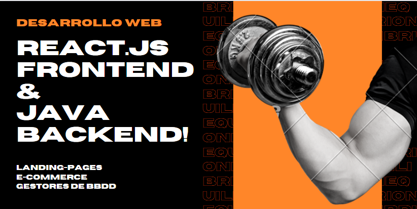

<h2 align="center">Hola mundo. Soy Alejandro 👋🤓</h2>

Estudié la carrera Analista programador universitario hasta 3er año. Programo en JavaEE, fullstack (mid-level), y en React.js(learning) con backend en Java. Soy casi 100% autodidacta (una trampa, fuí a la facultad), pero más allá de haber ido a la facultad, aprendo de Udemy, de Codecademy, de Google actívate, de donde salga un curso, youtube, de foros.

Soy versátil, y muy proactivo, me gusta mucho trabajar solo; one-man-army, pero no tengo problema en trabajar en equipo también. Tengo muchos planes para el futuro próximo, ya que enseño en Udemy y también estoy creando un perfil de youtuber para monetizar, voy a crear tutoriales a lo loco. jajja, también a freelancear un poco, si surge algo interesante. Contáctenme en LinkedIn, soy buena onda y los puedo guiar en lo que necesiten. Saludirijillos (Por qué todo con -illo!!!)

  
  

  <h1 align="center">:computer: <a href="https://alexielardilla.github.io/portfolio-ale-vera/" target="_blank">Mi portfolio</a></h1>
<!--
**AlexielArdilla/AlexielArdilla** is a ✨ _special_ ✨ repository because its `README.md` (this file) appears on your GitHub profile.

Here are some ideas to get you started:

- 🔭 I’m currently working on ...
- 🌱 I’m currently learning ...
- 👯 I’m looking to collaborate on ...
- 🤔 I’m looking for help with ...
- 💬 Ask me about ...
- 📫 How to reach me: ...
- 😄 Pronouns: ...
- ⚡ Fun fact: ...
-->
