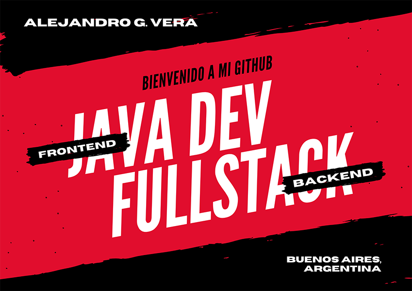

<h2 align="center">Hola mundo. Soy Alejandro 👋🤓</h2>

Estudié la carrera Analista programador universitario. Programo más que nada en javaEE, y en el frontend uso Bootstrap4 y obviamente HTML5 CSS3 y JS. Separo el desarrollo web de Java, ya que si bien programo en Java web, los veo como dos temas separados. Por un lado están mis proyectos web y por otro los de Java FullStack. Me encanta crear proyectos, pueden ver mis favoritos más abajo. Soy antes que nada creativo y autodidacta. También me gusta ser confiable y versátil.

  <h3 align="center">:computer: <a href="https://alexielardilla.github.io/portfolio-ale-vera/" target="_blank">Mi portfolio</a></h3>
<!--
**AlexielArdilla/AlexielArdilla** is a ✨ _special_ ✨ repository because its `README.md` (this file) appears on your GitHub profile.

Here are some ideas to get you started:

- 🔭 I’m currently working on ...
- 🌱 I’m currently learning ...
- 👯 I’m looking to collaborate on ...
- 🤔 I’m looking for help with ...
- 💬 Ask me about ...
- 📫 How to reach me: ...
- 😄 Pronouns: ...
- ⚡ Fun fact: ...
-->
