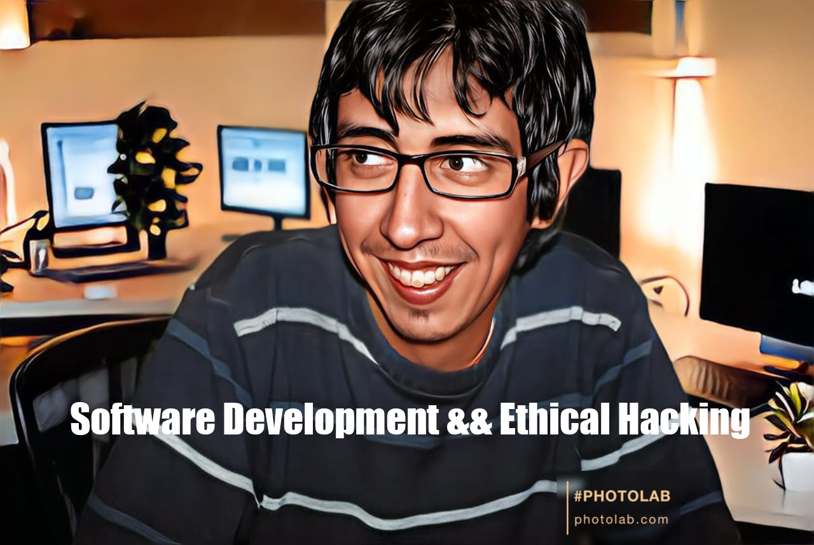

 

<h2 align="center">Hello world! I'm Alejandro ✨</h2>

  

  

 

# About Me

---

### About Me - Alejandro G Vera

I am Alejandro G Vera, a dedicated and multifaceted professional with a solid educational foundation and a passion for technology and human development. My journey is marked by a series of academic achievements and practical experiences that blend technical expertise with a profound understanding of human behavior and well-being.

#### Professional and Academic Background

**Expert University in Ethical Hacking - UTN:** I hold an Expert University degree in Ethical Hacking from the National Technological University (UTN). This program equipped me with the skills to protect and secure digital infrastructures, ensuring that sensitive information remains safeguarded against cyber threats. My training included hands-on experience in identifying vulnerabilities, conducting penetration tests, and implementing robust security measures.

**Professional FullStack Developer - UTN:** As a Professional FullStack Developer, also from UTN, I have a comprehensive understanding of both front-end and back-end development. I am proficient in creating dynamic and responsive web applications using React and Node.js. My expertise extends to backend development with Java, my first programming language, which I utilize to build robust and scalable server-side applications.

**CS50x Cybersecurity Course - Harvard (via Edutin):** I completed Harvard's renowned CS50x Cybersecurity course through Edutin, where I delved deep into the principles of computer security, cryptography, and network security. This course provided me with a solid grounding in protecting data integrity and privacy in the digital age.

**Google Cybersecurity Course - Coursera:** My learning journey continued with Google's Cybersecurity course on Coursera. This program enhanced my understanding of modern cybersecurity practices and strategies, preparing me to tackle the ever-evolving challenges in the field of cybersecurity.

**English Proficiency - FCE:** I am proficient in conversational English, having passed the First Certificate in English (FCE). This skill enables me to engage effectively in international settings, enhancing my ability to collaborate with global teams and access a broader range of resources.

**Licenciatura en Gestión TI - UNPAZ:** I have completed 24 courses towards my degree in Information Technology Management at the National University of José C. Paz (UNPAZ). This program has provided me with a strong foundation in managing IT projects, understanding organizational needs, and implementing technology solutions that drive business success.

#### Personal Development and Interests

**NLP Practitioner and Counseling:** Beyond my technical expertise, I am a certified NLP Practitioner, having undertaken various courses in Neuro-Linguistic Programming, counseling, and social psychology. These qualifications enable me to understand and influence human behavior, foster personal growth, and improve communication skills. I believe that the fusion of technology and psychology can lead to innovative solutions and improved human experiences.

**Social Psychology:** My studies in social psychology have given me insights into human interactions and societal trends. This knowledge is invaluable in creating user-centered technology solutions that consider the psychological and emotional needs of users.

#### Vision and Aspirations

I am passionate about leveraging my diverse skill set to create secure, efficient, and human-centric technological solutions. My goal is to bridge the gap between technology and human well-being, ensuring that digital advancements contribute positively to society. Whether it’s developing secure applications, managing IT projects, or helping individuals through NLP and counseling, I am committed to making a meaningful impact.

In a rapidly evolving digital landscape, I am continuously learning and adapting, driven by curiosity about new technologies and a desire to understand the human mind. I believe that knowledge is the key to creating positive change, and I am dedicated to using my expertise to contribute to a safer, more connected, and empathetic world.

<h3>Alexx</h3>

<h2 align="center">Known technologies👨🏻‍💻</h2>
<!--tech stack icons-->

  

<!--Prueba-->

<h2 align="center">Some videos about IT from my Youtube channel👨🏻‍💻</h2>

<table align="left" >
<tr border="none">
  
  <td width="25%" align="center">
    

     
      

    

        
    
       
</td>
  
<td width="25%" align="center">
    

     
      

    

        
     
       
</td>
  
  <td width="25%" align="center">
    

     
      

    

        
    
       
</td>

   <td width="25%" align="center">
    

     
      

    

        
    
       
</td>
  
</tr>
</table>
  

 
  
<h1 align="center">My favorite projects:</h1>
