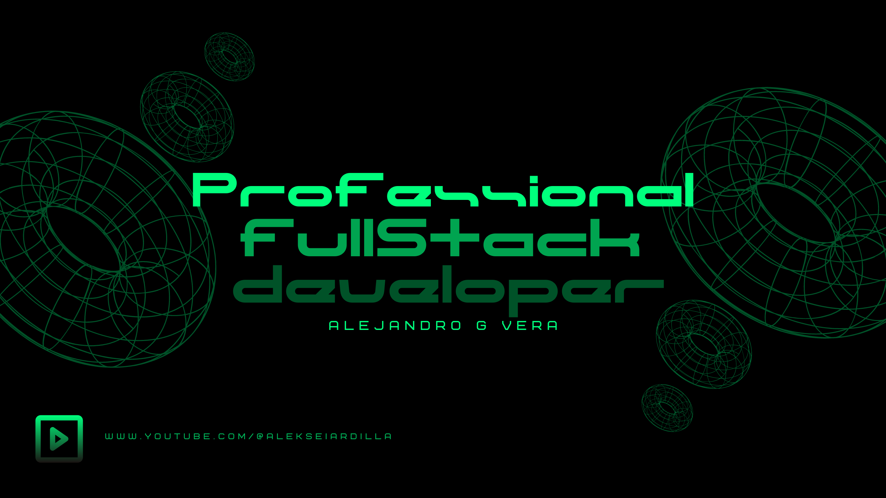

 

<h2 align="center">Hola mundo. Soy Alejandro ✨</h2>

  

  

 

¡Hola! Soy Alexx, un apasionado profesional con una formación diversa y una profunda vocación por el aprendizaje continuo y el desarrollo personal y profesional. 

Soy Experto Universitario en Ethical Hacking certificado por la Universidad Tecnológica Nacional (UTN), lo que me ha permitido adquirir habilidades avanzadas en ciberseguridad y protección de sistemas informáticos. Actualmente, comparto mis conocimientos y experiencias como instructor en Udemy.com, donde disfruto de la oportunidad de ayudar a otros a desarrollarse en el fascinante mundo de la tecnología y la seguridad digital.

Además de mi inclinación por la tecnología, también tengo un fuerte interés en el ámbito social y el bienestar humano. Soy Experto Universitario en Counseling y Practicante de Programación Neurolingüística (NLP Practitioner), entre otras certificaciones. Estas credenciales reflejan mi dedicación a entender y mejorar la dinámica humana, tanto a nivel individual como grupal.

Me apasiona estudiar temáticas relacionadas con lo social y la psicología, ya que creo firmemente en el poder del conocimiento para generar cambios positivos en la vida de las personas. Mi enfoque proactivo y conciliador en las dinámicas de grupo me ha permitido colaborar de manera efectiva en equipos diversos, siempre buscando el crecimiento colectivo y el bienestar común.

En resumen, mi carrera es un reflejo de mi deseo constante de aprender, enseñar y aplicar mis conocimientos en diferentes áreas para contribuir a un entorno más seguro y comprensivo. Estoy siempre en busca de nuevas oportunidades para crecer y colaborar en proyectos que marquen la diferencia.

<h3>Alexx</h3>

<h2 align="center">Tecnologías conocidas👨🏻‍💻</h2>
<!--tech stack icons-->

  

<!--Prueba-->

<h2 align="center">Algunos videos sobre IT de mi canal de Youtube👨🏻‍💻</h2>

<table align="left" >
<tr border="none">
  
  <td width="25%" align="center">
    

     
      

    

        
    
       
</td>
  
<td width="25%" align="center">
    

     
      

    

        
     
       
</td>
  
  <td width="25%" align="center">
    

     
      

    

        
    
       
</td>

   <td width="25%" align="center">
    

     
      

    

        
    
       
</td>
  
</tr>
</table>
  

 
  
<h1 align="center">Mis proyectos favoritos:</h1>
