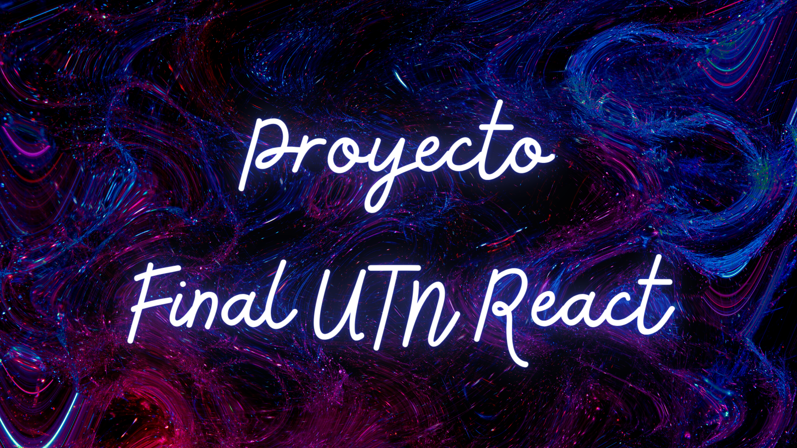

 
---
Content Creator (KDP Select) | Udemy Instructor | Cybersecurity | Ethical Hacking Instructor | Full-Stack Dev | Programming (Java, Python, JavaScript) | Software Development | Technical Author | Online Education

## 🕶️ About Me – AlexielArdilla
---
I am **Alejandro G. Vera**, a technology professional and content creator with a strong focus on **digital publishing** and **online education**. My two main areas of expertise are:

* 📚 **Content Creation for KDP Select** – Author of multiple books on cybersecurity, ethical hacking, digital forensics, and programming, distributed worldwide through Amazon Kindle.
* 🎓 **Teaching on Udemy.com** – Instructor with more than **57,000 students enrolled globally**, specializing in programming, cybersecurity, and full-stack development.

Alongside these core areas, I bring a solid academic background as an **Analista Programador Universitario (UNPAZ)**, complemented by professional certifications in:

* 🔐 **Cybersecurity & Ethical Hacking** – UTN, Google (Coursera), Edutín, Codecademy, Udemy.
* 💻 **Full-Stack Development** – UTN and Codecademy.

### 🛠️ Technical Skills

* **Programming Languages:** Java, Python, JavaScript, and more.
* **Web & Software Development:** Full-stack applications, APIs, and system integration.
* **Cybersecurity Expertise:** Ethical hacking, penetration testing, and digital forensics.

### 🌍 Professional Mission

My mission is to combine **technical expertise** with **knowledge sharing**. By publishing books, developing educational content, and teaching thousands of students, I aim to make complex topics in **programming** and **cybersecurity** more accessible to learners worldwide.

### 📈 Keywords & Focus (SEO-friendly)

KDP Select · Online Teaching · Udemy Instructor · Cybersecurity · Ethical Hacking · Full-Stack Developer · Programming · Digital Publishing · Technical Author · Software Development

📬 **These days, I am fully dedicated to online training and the creation of multimedia content.**

---

<h2 align="center">Known Technologies👨🏻‍💻</h2>
<!--tech stack icons-->

  

<!--Prueba-->

<h2 align="center"Algunos videos de IT de mi canal de Youtube👨🏻‍💻</h2>

<table align="left" >
<tr border="none">
  
  <td width="25%" align="center">
    

     
      

    

        
    
       
</td>
  
<td width="25%" align="center">
    

     
      

    

        
     
       
</td>
  
  <td width="25%" align="center">
    

     
      

    

        
    
       
</td>

   <td width="25%" align="center">
    

     
      

    

        
    
       
</td>
  
</tr>
</table>
  

 
  
<h1 align="center">Mi pet projects:</h1>
