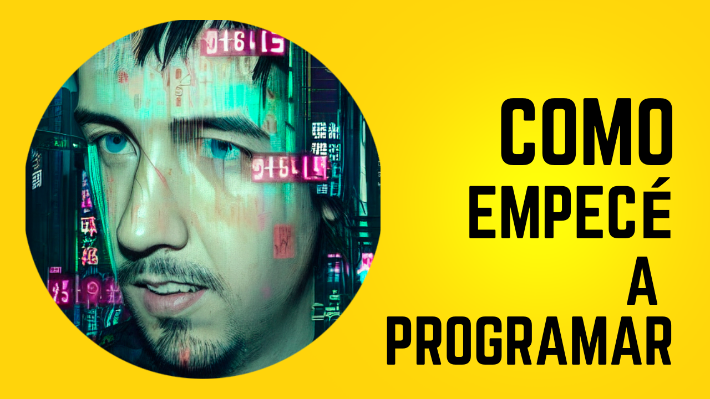

<h2 align="center">Hola mundo. Soy Alejandro ✨</h2>

  

  

 

🔥 Me destaco en varios campos profesionales. La programación, la enseñanza online (múltiples áreas pueden ver en mi linktree) y presencial de Inglés y Guitarra. 

🎓 Estudio la diplomatura **Professional Full-Stack Developer en la UTN**. También estoy haciendo El curso de **Inglés del Centro Universitario de Idiomas de la UBA nivel B2** (actualizado: ya terminé el curso, aprobado). Otros varios cursos de Udemy, y la carrera de **Full-Stack Engineer en Codecademy**.

🚀 Mi objetivo es innovar, encontrar algo que no haya sido visto y desarrollarlo, un software, un framework, alguna modalidad de coding. 

☎️ También me interesa lo social, es por eso que estudio para counselor (actualizado: ya terminé el curso, aprobado). Amo estudiar temáticas relacionadas a lo social y a la psicología, y me encanta ser proactivo y conciliador en las dinámicas de grupo.

💎 Síganme o agréguenme si lo desean en linkedIn: https://www.linkedin.com/in/alejandro-gonzalo-vera/

❌ No me encuentro en busca de empleo actualmente.

💯 https://linktr.ee/alexielardilla

Saludos cordiales.

<h3>Alexx</h3>

<h2 >Tecnologías conocidas👨🏻‍💻</h2>
<!--tech stack icons-->

  

<!--Prueba-->

<h2 >Algunos videos sobre IT de mi canal de Youtube👨🏻‍💻</h2>

<table align="left" >
<tr border="none">
  
  <td width="25%" align="center">
    

     
      

    

        
       
      
    
       
</td>
  
<td width="25%" align="center">
    

     
      

    

        
       
      
     
       
</td>
  
  <td width="25%" align="center">
    

     
      

    

        
       
      
    
       
</td>

   <td width="25%" align="center">
    

     
      

    

        
       
      
    
       
</td>
  
</tr>
</table>
  

 
  
 
   
  

